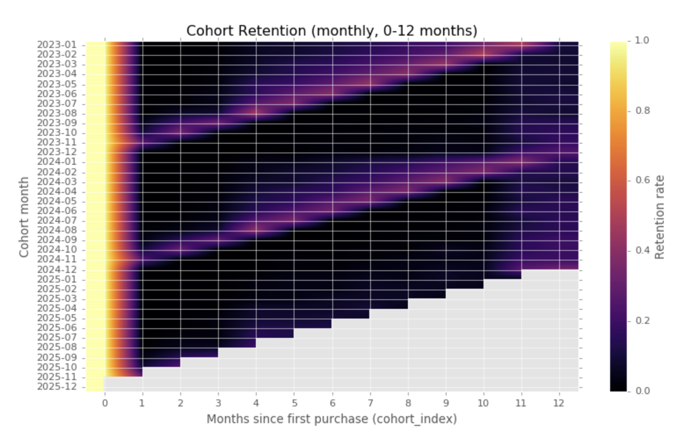
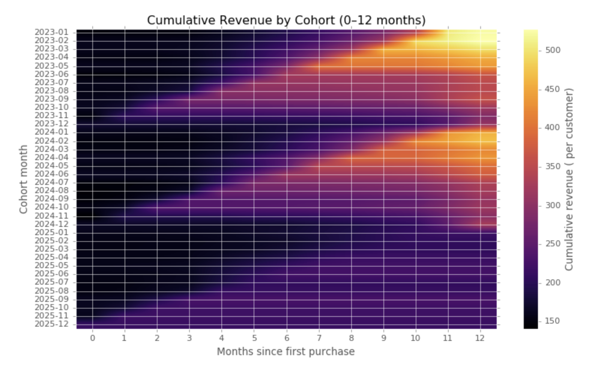
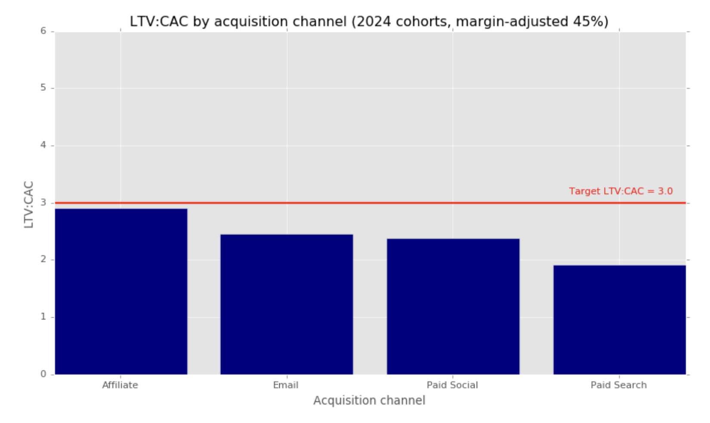

# Cohort Retention Analysis + LTV:CAC (Marketing Analytics)

## Preview (key visuals)

## Preview (key visuals)

### Cohort retention (0–12 months)


### Cumulative revenue per customer (0–12 months)


### Unit economics (LTV:CAC vs target)


This project analyzes **customer retention cohorts** and **unit economics (LTV:CAC)** for a synthetic e-commerce dataset.  
Goal: demonstrate practical marketing analytics skills (cohorts, retention, LTV proxy, CAC, channel comparison) and clear business interpretation.

## Outputs (quick links)
- **PDF report:** [`reports/cohort_retention_ltv_cac.pdf`](reports/cohort_retention_ltv_cac.pdf)
- **HTML report:** [`reports/cohort_retention_ltv_cac.html`](reports/cohort_retention_ltv_cac.html)
- **Main notebook (code):** [`notebooks/cohort_retention_ltv_cac_code.ipynb`](notebooks/cohort_retention_ltv_cac_code.ipynb)

## Business questions
- **Retention:** What share of customers return in months 1–12 after first purchase?
- **LTV shape:** How does cumulative revenue per customer evolve in the first 12 months?
- **Unit economics:** How does **LTV:CAC** compare across acquisition channels vs a target (e.g., 3.0)?

## Key findings (high level)
- **Retention pattern:** Retention drops sharply right after the first purchase (month 0 → month 1) and then remains relatively low and stable, with a **clear seasonal uplift around December** (holiday-driven repeat behavior).
- **Revenue / LTV shape:** Cumulative revenue per customer increases most in the early months and then **flattens**, meaning a large share of value is captured in the early repeat window, with visible holiday impact for older cohorts.
- **Channel economics:** Margin-adjusted LTV:CAC differs across channels; some channels are closer to the target and therefore more scalable under the assumed unit economics model.

## Assumptions & limitations
- **LTV proxy:** LTV is approximated using a constant **45% contribution margin** applied to net revenue (margin-adjusted LTV:CAC).
- **Organic CAC:** Organic spend is not captured in media spend data, so CAC is not computed for Organic.
- **Synthetic data:** Dataset is synthetic and may not reflect real-world noise perfectly (still useful for demonstrating methods and storytelling).

## Repository structure
```text
.
.
├── assets/                              # PNGs used in README (preview on GitHub)
│   ├── cohort_retention_heatmap.png
│   ├── cumulative_revenue_heatmap.png
│   ├── ltv_cac_by_channel.png
│   └── ltv_cac_table.png                
├── data_clean/                          # cleaned CSVs used by the analysis
│   ├── dim_customers_2023_2025.csv
│   ├── fact_orders_2023_2025.csv
│   └── fact_marketing_spend_daily_2023_2025.csv
├── notebooks/
│   ├── 00_data_preprocessing.ipynb      # data cleaning / formatting notebook
│   └── 01_cohort_retention_ltv_cac_code.ipynb
├── reports/
│   ├── cohort_retention_ltv_cac.pdf
│   └── cohort_retention_ltv_cac.html
├── requirements.txt
└── README.md

